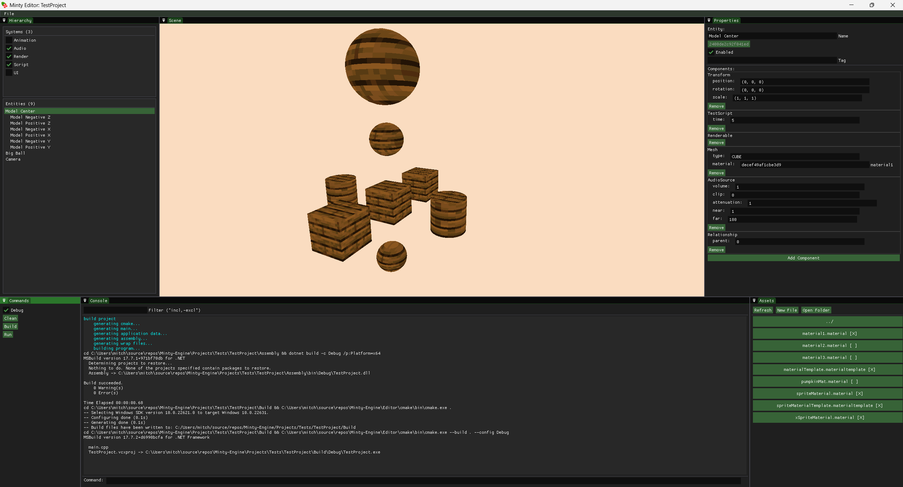

# Minty Engine
A dynamic and advanced game engine.

NOTE: This project is in development. More info on how to use, etc. will come in due time.

For how to install the engine (for engine development, or for game development), check out the [installation guide](https://github.com/mtalyat/Minty-Engine/wiki/Installation).

# Editor

The Minty Engine provides a powerful game editor, which allows for easy and efficient game development.

# About

This game engine was started as a result of the [2023 Unity pricing model change](https://www.theverge.com/2023/9/12/23870547/unit-price-change-game-development). The goal is to have a functioning multi-purpose game engine, except that its free to use, and always will be.

## Features

* Vulkan-based rendering engine
* Entity component system
* C# scripting
* Audio engine
* Asset manager
* Model loading
* Scene management
* 3D, 2D, and UI rendering
* Visual editor
* Multiple build modes (debug/release)
* Support for Dear ImGUI

## Goals

### Performance
Performace, in terms of the CPU and the GPU. On the CPU, libraries such as [EnTT](https://github.com/skypjack/entt) will be used to allow for many moving parts. An entity component system was chosen to help take advantage of powerful CPUs. Although classic OOP architecture is much easier to understand, ECS offers many advantages, especially in terms of performance, that you could never achieve with OOP.

### Networking
Who doesn't love playing with your friends? The Minty engine will have built-in networking capabilities to make it easy (easier- its not easy) to implement multiplayer games.

### Ease of Use
The engine and editor will be easy to use. If anybody has a problem or bug, please post on the GitHub issues page, I would be happy to help.

## Technology
The Minty Engine will use a multitude of advanced and new technologies to make the most of the computer being used. This includes, but is not limited to:

* [Vulkan](https://www.vulkan.org), for graphics.
* [GLFW](https://www.glfw.org), for windows.
* [GLM](https://github.com/g-truc/glm), for linear mathematics.
* [EnTT](https://github.com/skypjack/entt), for the entity component system.
* [stb](https://github.com/nothings/stb), for loading images from the disk.
* [SoLoud](https://github.com/jarikomppa/soloud), for loading and playing audio.
* [Dear ImGui](https://github.com/ocornut/imgui), for the editor user iterface.
* [Mono](https://www.mono-project.com), for C# scripting.
* [TinyXML-2](https://github.com/leethomason/tinyxml2), for writing and reading XML files.
